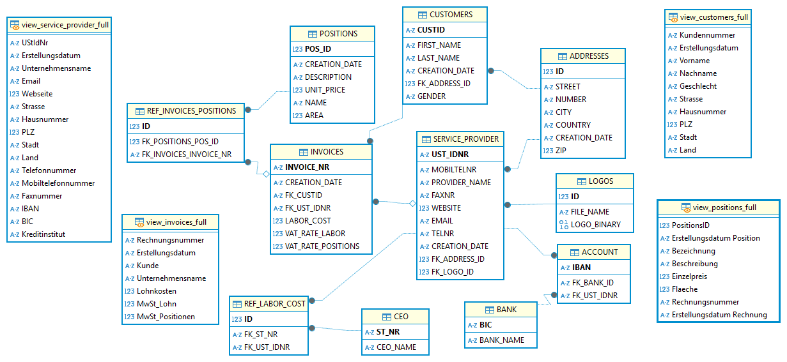

# 

# LF11: Rechnungsverwaltung

## Anwenderdokumentation & Entwicklungsdokumentation

---

## Inhaltsverzeichnis

1. [Produktinformationen](#produktinformationen)
2. [Projektübersicht](#projektübersicht)
3. [Inhaltsverzeichnis](#inhaltsverzeichnis)
4. [Anwenderdokumentation](#anwenderdokumentation)
    - [Einleitung](#einleitung)
    - [Funktionen](#funktionen)
    - [Installation](#installation)
    - [Konfiguration](#konfiguration)
    - [Benutzung](#benutzung)
    - [Screenshots](#screenshots)
    - [Fehlerbehebung](#fehlerbehebung)
    - [FAQ](#faq)
    - [Kontakt & Support](#kontakt--support)
5. [Entwicklungsdokumentation](#entwicklungsdokumentation)
    - [Architekturüberblick](#architekturüberblick)
    - [Projektstruktur](#projektstruktur)
    - [Entwicklungsumgebung einrichten](#entwicklungsumgebung-einrichten)
    - [Coding Guidelines](#coding-guidelines)
    - [Wichtige Module & Komponenten](#wichtige-module--komponenten)
    - [Datenbankschema](#datenbankschema)
    - [API-Endpunkte](#api-endpunkte)
    - [Tests](#tests)
    - [Deployment](#deployment)
    - [Changelog](#changelog)
    - [Beitragende & Beiträge](#beitragende--beiträge)
    - [Lizenz](#lizenz)

---

## Produktinformationen

|                  |                              |
|------------------|------------------------------|
| **Projekt:**     | Invoice Manager              |
| **Version:**     | 1.0                          |
| **Datum:**       | 24.05.2025                   |
| **Autor:innen:** | Sebastian Große              |
| **Kontakt:**     | sebastian.grosse@grossese.de |

---

## Projektübersicht

Der Auftrag des Kundens im Rahmen des Projektes ist es, eine Software zur Erstellung, Verwaltung und Archivierung von Rechnungen zu entwickeln. Ziel ist es dabei, eine benutzerfreundliche Anwendung mit grafischer Oberfläche zu realisieren, die zur Rechnungserstellung dient. Hierbei werden die Daten in einer Datenbank gespeichert und bereitgestellt. Diese bildet somit die Grundlage für das Erfassen, Anzeigen und Bearbeiten von Informationen innerhalb des Programms.
Eine charakteristische Funktion der Anwendung besteht in der Möglichkeit, Rechnungen direkt über die Software zu drucken. Dafür soll eine integrierte Druckvorschau realisiert werden, die dem Benutzer einen optischen Kontrollgang über die Rechnung vor dem eigentlichen Ausdruck ermöglicht. Zusätzlich soll eine automatisierte Archivierung der Rechnungen im PDF- und XML-Dateiformat erfolgen. Diese sollen in einem Ordner komprimiert (.zip) und verschlüsselt im Speichersystem abgelegt werden.
Technologisch basiert das System auf einer SQL-Datenbank zur strukturierten Speicherung der Daten. Darüber hinaus kommt für die Umsetzung der Benutzeroberfläche und der Anwendungslogik die Programmiersprache Python zum Einsatz.


---

## Anwenderdokumentation

### Einleitung

Die Anwendung soll der Rechnungsverwaltung dienen.

---

### Funktionen

- Rechnungen erstellen und löschen
- Dienstleister hinzufügen und löschen
- Kunden hinzufügen und löschen
- Rechnungen exportieren
- Rechnungen als Vorschau anzeigen

---

### Installation

```bash
# Schritt-für-Schritt Installationsanleitung
git clone https://github.com/deinuser/deinrepo.git
cd deinrepo
pip install -r requirements.txt
```

---

### Konfiguration

Konfigurationen der Anwendung können in der Datei ```config.py``` vorgenommen werden. Die Anpassung der Debounce-Time der Echtzeitsuche kann dort ebenfalls geschehen.

---

### Benutzung

Beschreibe die Benutzung mit Beispielen, Kommandozeilenargumenten oder Navigationsanweisungen in der Oberfläche.

---

### Screenshots

Füge relevante Screenshots oder GIFs ein.


---

### Fehlerbehebung

| Problem           | Lösung                    |
|-------------------|--------------------------|
| Häufiges Problem  | So wird es behoben        |
| Weiteres Problem  | So wird es behoben        |

---

### FAQ

**F:** Häufig gestellte Frage?  
**A:** Antwort.

---

### Kontakt & Support

- E-Mail: [deine.email@example.com]
- GitHub Issues: [Repo-Issues-Link]

---

## Entwicklungsdokumentation

### Architekturüberblick

Die Software wurde mit der Programmiersprache Python (v3.13) programmiert und benötigt einige Dependencies wie PyQt6, die vorher - wie Python selbst - installiert sein müssen.
Die Speicherung der Daten erfolgt mit Hilfe einer lokalen SQLite-Datenbank. Dieser spezielle Datenbanktyp wird lokal in einer DB-Datei gespeichert.
Das Nutzerinterface wurde mit QtDesigner erstellt und ist bis ins letzte Detail responsive. Es passt sich somit an die Display-Begebenheiten eines jeden Nutzers an.

---

### Projektstruktur

```text
/
├── data/
├── Qt/
    ├── icons/
├── ...
```

---

### Funktionsdokumentation

**Funktionsname:**  
`init_tables`

**Parameter (Input):**
- `self` (*QMainWindow*): MainWindow

**Funktionsweise / Nutzen:**  
Diese Funktion übernimmt das Ausführen der Funktion `load_table` für jede QTableView ausgewiesen im Array `table_mapping`.

---

**Funktionsname:**  
`load_table`

**Parameter (Input):**
- `self` (*QMainWindow*): MainWindow
- `table_view` (*QTableView*): TableView
- `db_view` (*str*): Datenbank View

**Funktionsweise / Nutzen:**  
Diese Funktion übernimmt das Laden der Daten aus der Datenbank.  
Sie wird eingesetzt, um die gesammelten Daten in ein Model zu speichern und die QTableView zu rendern.

---

**Funktionsname:**  
`clear_and_enable_form_fields`

**Parameter (Input):**
- `self` (*QMainWindow*): MainWindow

**Funktionsweise / Nutzen:**  
Diese Funktion übernimmt das Leeren aller Eingabefelder des aktuellen Formulars.  
Sie nutzt die Funktion `get_next_primary_key`, um das Eingabefeld des PrimaryKeys automatisch mit dem nächsten PK-Wert zu füllen.

---

**Funktionsname:**  
`on_row_selected`

**Parameter (Input):**
- `self` (*QMainWindow*): MainWindow
- `current` (*QModelIndex*): Aktuelle TableView
- `db_view` (*str*): Datenbank View
- `table_view` (*QTableView*): TableView

**Funktionsweise / Nutzen:**  
Diese Funktion übernimmt das Laden der Detail-TableViews für Rechnungen und Dienstleister.  
Sie wird eingesetzt, um das Formular mit den Daten des ausgewählten Eintrages zu füllen und das Label des Erstellungsdatums zu aktualisieren. Dafür verwendet sie die Funktionen `load_invoice_positions`, `load_service_provider_details` und `update_form_and_label`.  

---

**Funktionsname:**  
`update_form_and_label`

**Parameter (Input):**
- `self` (*QMainWindow*): MainWindow
- `current` (*QModelIndex*): Aktuelle TableView
- `table_view` (*QTableView*): TableViews

**Rückgabewert (Output):**
- *Datentyp*: Beschreibung des Rückgabewerts.

**Funktionsweise / Nutzen:**  
Diese Funktion übernimmt … (z. B. eine bestimmte Berechnung, Datenverarbeitung, Validierung etc.).  
Sie wird eingesetzt, um … (Nutzen im Gesamtzusammenhang des Programms oder Moduls erklären).  
(Optional) Besonderheiten: z. B. Fehlertoleranz, Abhängigkeiten, Performanceaspekte.

---

### Coding Guidelines

- Namenskonventionen
- Codestyle
- Linting/Formatierung

---

### Wichtige Module & Komponenten

| Modul         | Beschreibung                                                                              |
|---------------|-------------------------------------------------------------------------------------------|
| mainwindow.py | Verantwortlich für die gesamte Funktionalitäten um das Main-Fenster und die Dialogfenster |
| utils.py      | Verantwortlich zum anzeigen von Fehler- und Informationsmeldungen                         |
| database.py   | Verantwortlich für die Konfiguration der Umgebungsvariablen                               |
| databse.py    |                                                                                           |
| logic.py      |                                                                                           |
| main.py       | Verantwortlich für das Starten des Programmes                                             |

---

### Datenbankschema




---

### Tests

Tests fanden innerhalb des Teams statt. Der Product Owner sowie der Scrum Master haben in regelmäßigen zeitlichen Abständen Tests von neu hinzugefügten Features vorgenommen.

---

### Deployment

--

---

### Changelog

| Version | Datum      | Änderungen              |
|---------|------------|-------------------------|
| 1.0.0   | 24.05.2025 | Erste Veröffentlichung  |

---

### Beitragende & Beiträge

--

---

### Lizenz

GPL-3.0

---

> _„Dokumentation ist ein Liebesbrief an das eigene zukünftige Ich.“_  
> — Damian Conway
